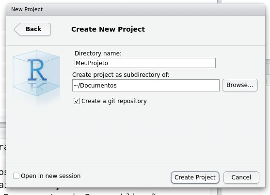

```{r setup, include=FALSE}
knitr::opts_chunk$set(echo = FALSE)
```


# Uma Proposta de *Workflow* Mínimo para Manuseio de Dados em R


## O que veremos

1. [Etapas de uma Análise de Dados](#4)
1. [Uma Proposta de *Workflow*](#9)
1. [Implementando o *SEU* Projeto](#15)


# Etapas de uma Análise de Dados


## Etapas de uma Análise de Dados

1. Coleta de Dados
1. Preparação dos Dados
1. Análise dos Dados
1. Comunicação dos Achados


## Etapas de uma Análise de Dados

### Preparação dos Dados

- Repita quantas vezes precisar:
1. Importação dos Dados
1. Crítica dos Dados
    - Análise Descritiva
    - Visualização dos Dados
1. Se Encontrou Problemas:
    - Verificação dos Dados
        - Listagem de Valores a Verificar
    - Repetir o Ciclo


## Etapas de uma Análise de Dados

### Análise dos Dados

- Repita quantas vezes precisar:
1. Visualização dos Dados
1. Análise Descritiva/Análise Exploratória
1. Análise Inferencial/Modelagem Formal
1. Se o Resultado da Análise for insatisfatório:
    - Transformação dos Dados
    - Repetir o Ciclo


## Etapas de uma Análise de Dados

### Comunicação dos Achados

1. Representação Visual dos Achados
1. Relato Textual e Interpretação dos Achados


# Uma Proposta de *Workflow*


## Uma Proposta de *Workflow*

1. Preparação do ambiente de análise de dados
1. Preparação dos Dados
1. Análise dos Dados + Relatório da Análise


## Uma Proposta de *Workflow*

1. Preparação do ambiente de análise de dados
    1. Crie uma pasta nova para o projeto
        - subpasta para os arquivos de dados originais
    1. Crie um projeto (`.Rproj`) no `R Studio`
        - use o Sistema de Controle de Versão `Git`
1. Preparação dos Dados
1. Análise dos Dados + Relatório da Análise


## Uma Proposta de *Workflow*

1. Preparação do ambiente de análise de dados
1. Preparação dos Dados
    1. Crie um programa `.R` para a Importação
        - Crie um arquivo `.Rdata` com os dados importados
    1. Crie um documento `.Rmd` para a Documentação do Conjunto de Dados
    1. Crie um programa `.R` para a Crítica
1. Análise dos Dados + Relatório da Análise


## Uma Proposta de *Workflow*

1. Preparação do ambiente de análise de dados
1. Preparação dos Dados
1. Análise dos Dados + Relatório da Análise
    1. Crie um documento `.Rmd` para a Análise Descritiva/Exploratória
    1. Crie um documento `.Rmd` para a Análise Inferencial/Modelagem


## Etapas Abordadas neste Curso

1. Preparação do ambiente de análise de dados
    - Estrutura de pastas para o projeto
    - Projeto no `R Studio` com controle de versão
1. Preparação dos Dados
    - Programa para a Importação
    - Documentação do Conjunto de Dados
    - Programa para a Crítica


# Implementando o *SEU* Projeto


## Implementando o *SEU* Projeto

- [Projeto no `R Studio`](#17)
- [Programa de Importação](#40)
- Documentação do Conjunto de Dados
- Programa de Crítica


# Projeto no `R Studio`


## Projeto no `R Studio`

Ok, Agora é a hora de *Você* começar a usar o *seu* conjunto de dados.

Vamos começar criando um projeto novo no `R Studio`.


## Projeto no `R Studio`

Abra o `R Studio` e clique no Botão `Project: (None)`.


## Projeto no `R Studio`

Clique em `New Project`.


## Projeto no `R Studio`

Clique em `New Directory`.


## Projeto no `R Studio`

Clique em `Empty Project`.


## Projeto no `R Studio`

1. Digite em `Directory Name` o nome da pasta a ser criada .
1. `Browse...` serve para mudar onde a pasta será criada.
1. **IMPORTANTE**: habilite a opção `Create a git repository`.




## Projeto no `R Studio`

Note:


## Projeto no `R Studio`

Note:

1. o nome do projeto acima do painel superior direito;
1. o nome da pasta na Aba `Console` no painel inferior esquerdo;
1. o conteúdo da pasta (com um arquivo `.Rproj`) na Aba `Files` no painel 
inferior direito; e
1. que existe uma Aba `Git` no painel superior direito.


## Projeto no `R Studio`

Clique no Botão `New Folder` dentro da Aba `Files`.


## Projeto no `R Studio`

Digite `originais` como nome da nova pasta que você vai criar.


## Projeto no `R Studio`

Copie agora os arquivos de dados originais para dentro da pasta `originais` que 
você acabou de criar.

Não continue antes de realizar esta etapa!


## Projeto no `R Studio`

Clique na Aba `Git` para ver o sistema de controle de versão.


## Projeto no `R Studio`

Clique no Botão `Commit` para abrir a janela do sistema de controle de versão


## Sistema de Controle de Versão

Note na janela superior esquerda.


## Sistema de Controle de Versão

Note que os nomes dos arquivos que aparecem na janela superior direita são 
precedidos por duas interrogação em amarelo na Coluna `Status`.

Isso significa que o sistema de controle de versão não sabe o que você quer 
fazer com esses arquivos.

Você pode:

1. monitorar e salvar as mudanças feitas no arquivo com a opção `Stage`;
1. descartar todas as mudanças no arquivo e recuperar a versão anterior com a 
opção `Revert`; e
1. escolher nunca monitorar as modificações do arquivo com a opção `Ignore`


## Sistema de Controle de Versão

Selecione a caixa na Coluna `Staged` do primeiro item e note que as `?` em 
amarelo da Coluna `Status` mudaram para um único `A` único em verde.

|                    |                   |
|:------------------:+:-----------------:|
|   |  |

Isso que dizer que o sistema de controle de versão vai incluir esse arquivo na 
lista de arquivos a serem monitorados.


## Sistema de Controle de Versão

Selecione a caixa na Coluna `Staged` de todos os outros itens e note que as `?` 
em amarelo da Coluna `Status` mudaram para um único `A` único em verde.

|                    |                   |
|:------------------:+:-----------------:|
|   |  |

Isso que dizer que o sistema de controle de versão vai incluir todos esse 
arquivo na lista de arquivos a serem monitorados.


## Sistema de Controle de Versão

Digite `commit inicial` na caixa de texto na Janela `Commit message` e clique no 
Botão `Commit` para registrar a primeira versão desses arquivos.


## Sistema de Controle de Versão

Se apareceu uma janela como esta, então tudo correu bem.

Clique no Botão `Close`


## Sistema de Controle de Versão

Agora, você deve estar vendo a janela do sistema de controle de versão sem 
nenhum item na lista da janela superior esquerda.


Isso significa que não há alterações a serem nem salvas, nem descartadas e nem 
revertidas.


## Sistema de Controle de Versão

Na próxima vez que você for registrar as alterações que você fizer, cada 
arquivo será comparado com a última versão salva e as modificações encontradas 
em cada arquivo serão armazenadas no repositório que foi criado.

Assim, o seu projeto vai sendo salvo a cada *commit*, de modo que será possível 
rastrear as modificações feitas ao longo do projeto e até mesmo reverter o 
projeto para qualquer etapa salva.

Veremos mais sobre isso ao longo do curso.


# Voltando um pouco...

Volte para a apresentação  
[Tratamento e Manuseio de Dados com R](tratamento.dado.R.html)


# Programa de Importação


## Programa de Importação


# Documentação do Conjunto de Dados


## Documentação do Conjunto de Dados


# Programa de Crítica


## Programa de Crítica


